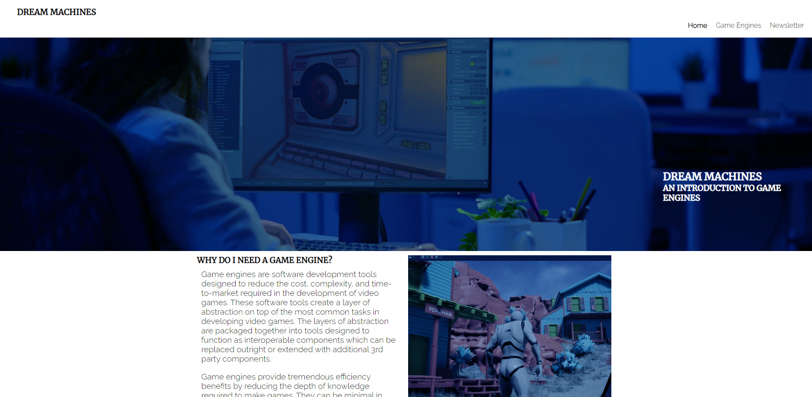

# Dream Machines

Dream Machines is a website to introduce and inform those interested in game development about why they should use a game engine and which ones might be appropriate for them.

The goal of the website is to educate those who might find it difficult to know where to start with game development and offer a solution through breaking down which engines do what, what games have been made with the game engines, their strengths and weaknesses and providing a practical starting point with an embedded youtube tutorial from a quality source.

A newsletter and social media links will provide furtger engagement and direction for anyone who needs more information or has questions.

## Features 

In this section, you should go over the different parts of your project, and describe each in a sentence or so. You will need to explain what value each of the features provides for the user, focusing on who this website is for, what it is that they want to achieve and how your project is the best way to help them achieve these things.

### Existing Features

- __Navigation Bar__

  - Featured on all three pages, the full responsive navigation bar includes links to the Logo, Home page, Gallery and Sign Up page and is identical in each page to allow for easy navigation.
  - This section will allow the user to easily navigate from page to page across all devices without having to revert back to the previous page via the ‘back’ button. 

- __Game Engine Introduction__

  - The landing includes a photograph with text overlay to allow the user to see exactly which location this site would be applicable to. 
  - This section introduces the user to Love Running with an eye catching animation to grab their attention

- __Gallery of Game Examples and Engines__

  - The club ethos section will allow the user to see the benefits of joining the Love Running meetups, as well as the benefits of running overall. 
  - This user will see the value of signing up for the Love Running meetups. This should encourage the user to consider running as their form of exercise. 

- __Engine Specific Information__

  - This section will allow the user to see exactly when the meetups will happen, where they will be located and how long the run will be in kilometers. 
  - This section will be updated as these times change to keep the user up to date. 

- __The Footer__ 

  - The footer section includes links to the relevant social media sites for Love Running. The links will open to a new tab to allow easy navigation for the user. 
  - The footer is valuable to the user as it encourages them to keep connected via social media

- __Youtube Tutorial Embed for Each Engine__

  - The gallery will provide the user with supporting images to see what the meet ups look like. 
  - This section is valuable to the user as they will be able to easily identify the types of events the organisation puts together. 

- __Newsletter Subscription Page__

  - This page will allow the user to get signed up to Love Running to start their running journey with the community. The user will be able specify if they would like to take part in road, trail or both types of running. The user will be asked to submit their full name and email address. 

For some/all of your features, you may choose to reference the specific project files that implement them.

In addition, you may also use this section to discuss plans for additional features to be implemented in the future:

### Features Left to Implement

- Another feature idea

## Testing 

I have tested the website using chromes developer tools to emulate different screen sizes and environments. This helped me to get feedback on how my website displayed at various screen sizes and use media queries and responsive CSS to ensure a consistent standard of user experience across desktop, phone and tablets.

### Validator Testing 

- HTML
  - No errors were returned when passing through the official W3C validator, only warnings about using headers in sections.
- CSS
  - No errors were found when passing through the official Jigsaw) validator

### Unfixed Bugs

 

## Deployment

This section should describe the process you went through to deploy the project to a hosting platform (e.g. GitHub) 

- The site was deployed to GitHub pages. The steps to deploy are as follows: 
  - In the GitHub repository, navigate to the Settings tab 
  - From the source section drop-down menu, select the Master Branch
  - Once the master branch has been selected, the page will be automatically refreshed with a detailed ribbon display to indicate the successful deployment. 

The live link can be found here - https://code-institute-org.github.io/love-running-2.0/index.html 

## Credits 

### Content 

- Home page text was taken from https://medium.com/@jaredehalpern/the-what-and-why-of-game-engines-f2b89a46d01f
- Engine specific text was taken from https://gamedevacademy.org/best-game-engines/
- The icons in the footer were taken from [Feather Icons](https://feathericons.com/ )

### Media

- Banner Image: https://www.storyblocks.com/video/stock/woman-game-sotware-developer-testing-new-game-overtime-at-night-in-start-up-creative-agency-company-tired-worker-developing-new-online-video-games-on-pc-with-modern-technology-b0hfrjn0dkjmzsg2h
- Unity Logo: https://commons.wikimedia.org/wiki/File:Unity_Technologies_logo.svg
- Godot Logo: https://godotengine.org/press
- Unreal Logo: https://commons.wikimedia.org/wiki/File:Unreal_Engine_Logo.svg
- Fortnite: https://www.playstation.com/en-us/games/fortnite/
- Hearthstone: https://www.ign.com/games/hearthstone-heroes-of-warcraft
- Sonic Colors https://www.ign.com/games/sonic-colors
- Newsletter Splash Image: https://thenextweb.com/news/engine-dominating-gaming-industry-right-now
- Genshin Impact: https://www.playstation.com/en-us/games/genshin-impact/
- Gears 5: https://www.dailystar.co.uk/tech/gaming/gears-5-review-embargo-gears-19338697
- Stray: https://www.playstation.com/en-ie/games/stray/
- Tunic: https://store.epicgames.com/en-US/p/tunic
- Deponia:  https://www.nintendo.co.uk/Games/Nintendo-Switch-games/Deponia-1544877.html
- Gun Toting Cats: https://kit9studio.itch.io/gun-toting-cats
- Godot page 1 :appimagehub.com/p/1255865
- Godot page 2 https://dev.to/elenadotnet/i-want-to-make-videogames-where-do-i-start-2fc5
- Unity page 1 https://www.theverge.com/2020/4/14/21219609/- video-game-tools-editor-developer-make-price-free-programming
- Unity page 2 https://www.megavoxels.com/learn/what-is-the-unity-game-engine/
- Unreal page 1 https://docs.unrealengine.com/5.0/en-US/level-editor-in-unreal-engine/
- Unreal page 2 https://docs.unrealengine.com/5.0/en-US/tools-and-editors-in-unreal-engine/

