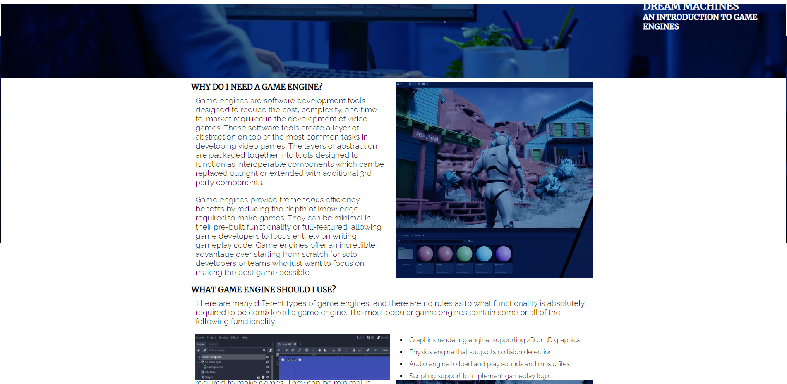
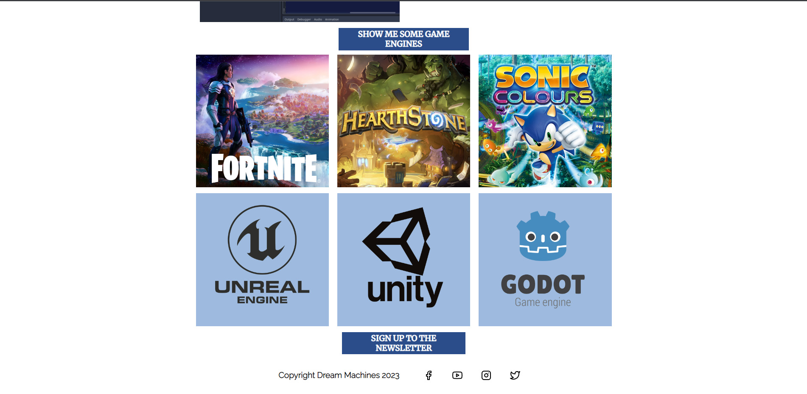
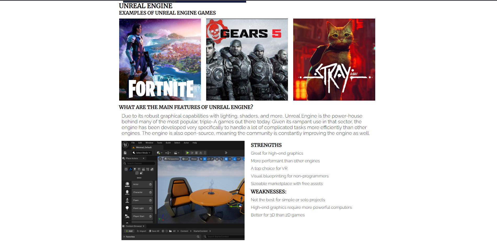
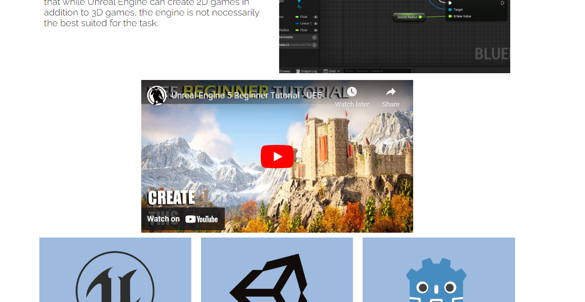
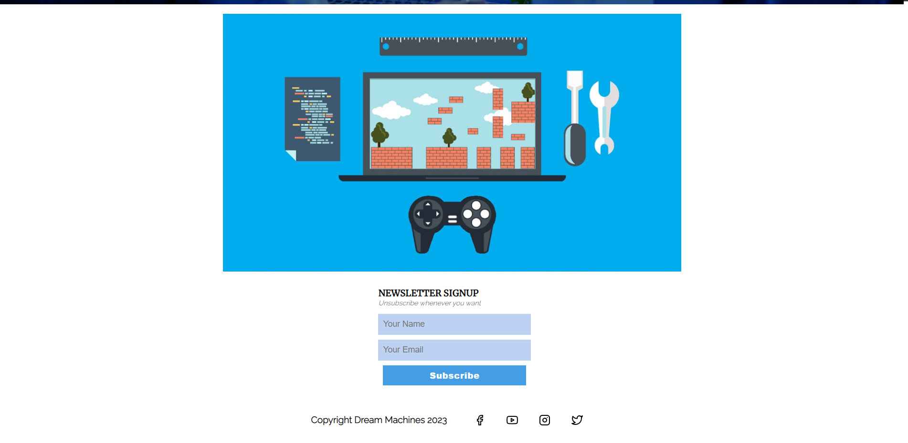
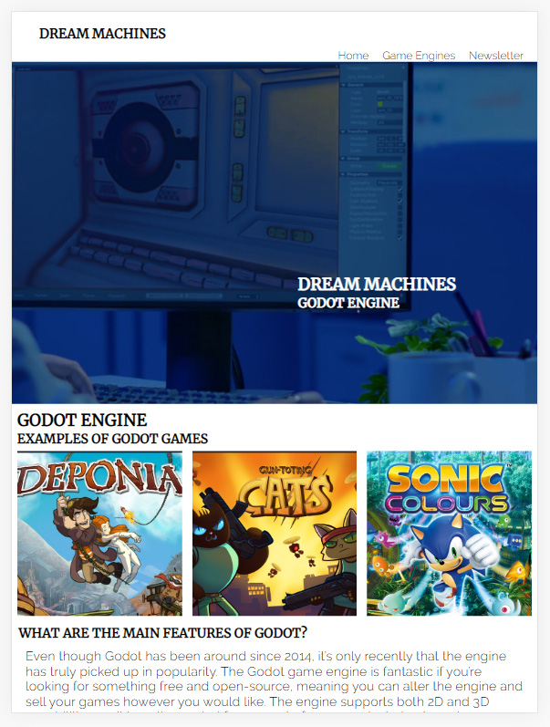
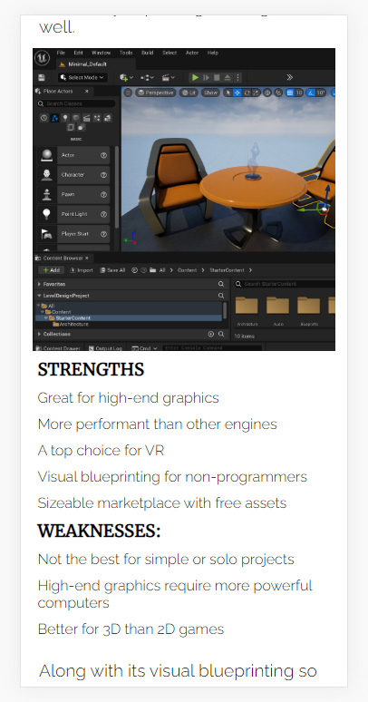

# Dream Machines

Dream Machines is a website to introduce and inform those interested in game development about why they should use a game engine and which ones might be appropriate for them.

The goal of the website is to educate those who might find it difficult to know where to start with game development and offer a solution through breaking down which engines do what, what games have been made with the game engines, their strengths and weaknesses and providing a practical starting point with an embedded youtube tutorial from a quality source.

A newsletter and social media links will provide furtger engagement and direction for anyone who needs more information or has questions.

## Features 

- __Navigation Bar__

  - Featured on all three pages, the full responsive navigation bar includes links to the Logo, Home page, Gallery and Sign Up page and is identical in each page to allow for easy navigation.
  - This section will allow the user to easily navigate from page to page across all devices without having to revert back to the previous page via the ‘back’ button. 

- __Game Engine Introduction__

  - The Game Engine Introduction section on the home page gives a brief rundown on why you would want to use a game engine vs building a bespoke set of tools. Listed after are some of the essential features of a game engine that help make a game developers job easier and should be part of any game engine they consider using.

- __Gallery of Game Examples and Engines__

  - Some examples of games that have been made in 3 game engines - Unreal, Unity and Godot - let the user get some context on how even AAA game developers use open source game engines. A link to each engines page is provided underneath to learn more. 

- __Engine Specific Information__

  - Unreal, Unity and Godot each have their own page listing game examples, a rundown of their features, their strengths and weaknesses, images of their editors and a youtube embed of a tutorial to get a jumpstart into using them.

- __The Footer__ 

  - The footer section includes links to the relevant social media sites for Dream Machines, twitter, instagram, facebook and youtube.
  - These social media platforms would be use to extend the amount of information that could be provided and build a community around game engine resources and answering questions.

- __Youtube Tutorial Embed for Each Engine__

  - These youtube videos are a fantastic starting point for anyone interested in the game engines. The videos are embedded to allow for quick viewing without leaving the website.

- __Newsletter Subscription Page__

  - A newsletter form allows the user to receieve emails with updates on new information, tips and tutorials for general game engine knowledge and news.

- __Responsive Design__

  - The website works across desktop, tablet and mobile, with the multi column layouts collapsing to a single column layout on smaller screens for a better reading experience.

## Testing 

I have tested the website using chromes developer tools to emulate different screen sizes and environments. This helped me to get feedback on how my website displayed at various screen sizes and use media queries and responsive CSS to ensure a consistent standard of user experience across desktop, phone and tablets.

### Validator Testing 

- HTML
  - No errors were returned when passing through the official W3C validator, only warnings about using headers in sections.
- CSS
  - No errors were found when passing through the official Jigsaw) validator

## Deployment

- The site was deployed to GitHub pages. The steps to deploy are as follows: 
  - In the GitHub repository, navigate to the Settings tab 
  - From the source section drop-down menu, select the Master Branch
  - Once the master branch has been selected, the page will be automatically refreshed with a detailed ribbon display to indicate the successful deployment. 

The live link can be found here - https://adam-daly.github.io/Project-1-HTML-CSS-Essentials/

## Credits 

### Content 

- Home page text was taken from https://medium.com/@jaredehalpern/the-what-and-why-of-game-engines-f2b89a46d01f
- Engine specific text was taken from https://gamedevacademy.org/best-game-engines/
- The icons in the footer were taken from [Feather Icons](https://feathericons.com/ )

### Media

- Banner Image: https://www.storyblocks.com/video/stock/woman-game-sotware-developer-testing-new-game-overtime-at-night-in-start-up-creative-agency-company-tired-worker-developing-new-online-video-games-on-pc-with-modern-technology-b0hfrjn0dkjmzsg2h
- Unity Logo: https://commons.wikimedia.org/wiki/File:Unity_Technologies_logo.svg
- Godot Logo: https://godotengine.org/press
- Unreal Logo: https://commons.wikimedia.org/wiki/File:Unreal_Engine_Logo.svg
- Fortnite: https://www.playstation.com/en-us/games/fortnite/
- Hearthstone: https://www.ign.com/games/hearthstone-heroes-of-warcraft
- Sonic Colors https://www.ign.com/games/sonic-colors
- Newsletter Splash Image: https://thenextweb.com/news/engine-dominating-gaming-industry-right-now
- Genshin Impact: https://www.playstation.com/en-us/games/genshin-impact/
- Gears 5: https://www.dailystar.co.uk/tech/gaming/gears-5-review-embargo-gears-19338697
- Stray: https://www.playstation.com/en-ie/games/stray/
- Tunic: https://store.epicgames.com/en-US/p/tunic
- Deponia:  https://www.nintendo.co.uk/Games/Nintendo-Switch-games/Deponia-1544877.html
- Gun Toting Cats: https://kit9studio.itch.io/gun-toting-cats
- Godot page 1 https://appimagehub.com/p/1255865
- Godot page 2 https://dev.to/elenadotnet/i-want-to-make-videogames-where-do-i-start-2fc5
- Unity page 1 https://www.theverge.com/2020/4/14/21219609/- video-game-tools-editor-developer-make-price-free-programming
- Unity page 2 https://www.megavoxels.com/learn/what-is-the-unity-game-engine/
- Unreal page 1 https://docs.unrealengine.com/5.0/en-US/level-editor-in-unreal-engine/
- Unreal page 2 https://docs.unrealengine.com/5.0/en-US/tools-and-editors-in-unreal-engine/

